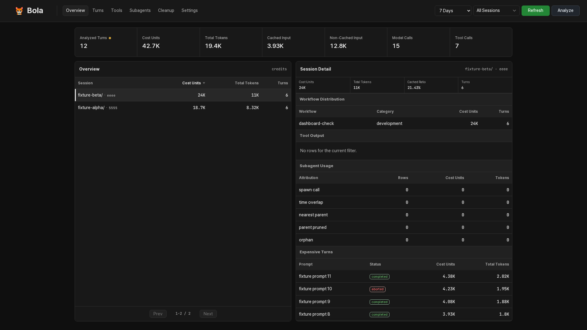
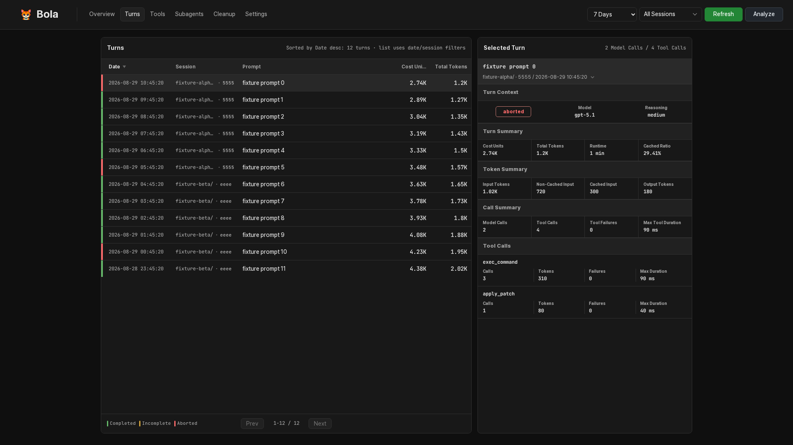
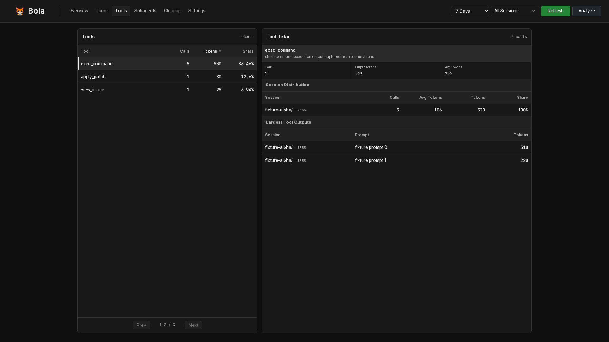
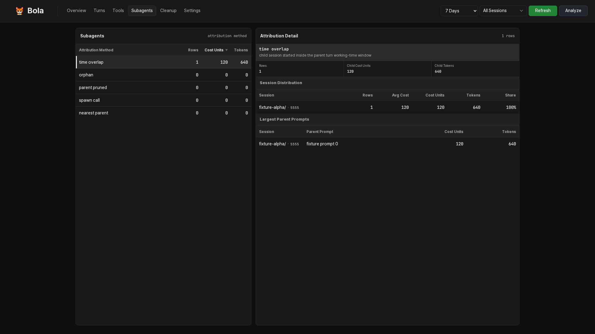
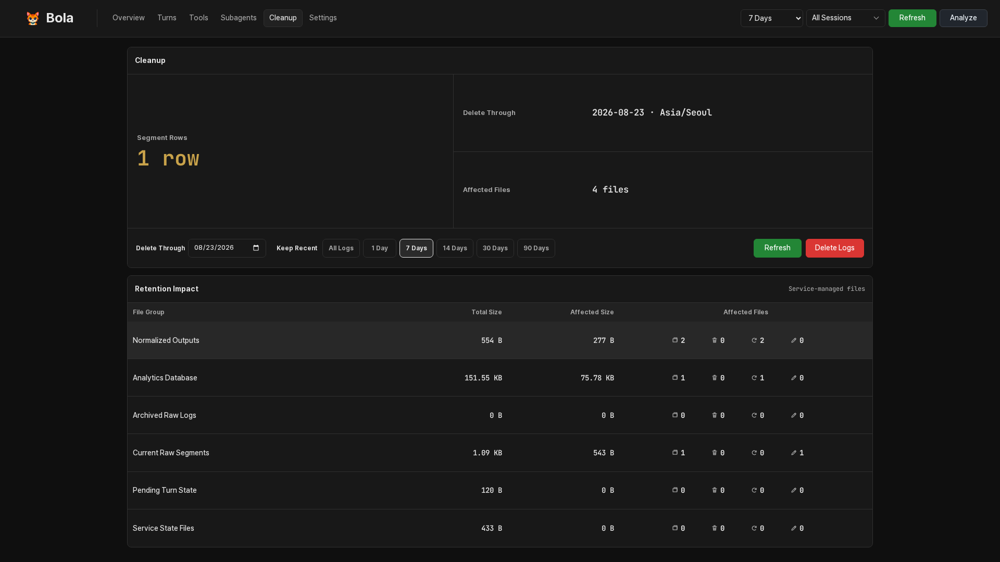
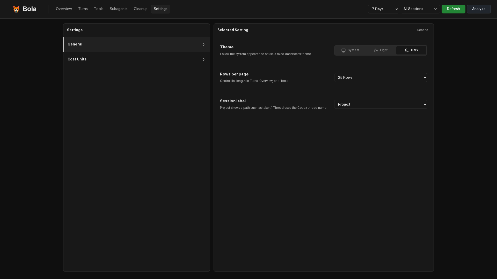

<h1 align="center">Codex Token Bola</h1>

<p align="center"><strong>Local-first token observability for Codex</strong></p>

<p align="center">
  Capture turn-level usage, trace model, tool, and subagent cost, and explore it
  through a loopback-only dashboard.
</p>

<p align="center">
  
  
  <a href="./LICENSE"></a>
</p>

Codex Token Bola converts local Codex hook events into searchable analytics
without sending transcripts to another service.



*All screenshots use synthetic sample data.*

<details>
<summary>More dashboard views</summary>

#### Turns



#### Tools



#### Subagents



#### Cleanup



#### Settings



</details>

## Highlights

- Compare estimated model cost from input, cached input, and output tokens
- Find expensive sessions, model calls, tool activity, and failed tool calls
- Attribute usage from spawned subagents back to their parent work
- Recover interrupted turns and surface malformed records instead of silently
  dropping them
- Analyze and delete local logs from a responsive loopback-only dashboard
- Keep raw captures as evidence while rebuilding derived analytics when needed

## Quick start

### Requirements

- Python 3.10 through 3.14
- an initialized Codex CLI with a working `codex --version`
- WSL2 Ubuntu for the verified runtime path

### 1. Install BOLA

From the cloned repository root:

```bash
python3 -m venv .venv
source .venv/bin/activate
python -m pip install .
bola --version
```

### 2. Register and verify the hook

#### Codex hooks

BOLA uses `UserPromptSubmit` for the turn baseline and `Stop` for the completed
token usage.

Register the hook with the effective paths, then verify the installation:

```bash
bola install-hook
bola doctor
```

#### `install-hook` options

| Option | Purpose | Environment override | Default on WSL/Linux |
| --- | --- | --- | --- |
| `--codex-dir` | Codex state input and hook registration | `CODEX_HOME` | `~/.codex` |
| `--output-dir` | BOLA-generated data | `BOLA_OUTPUT_DIR` | `~/.local/share/bola` |

Path priority: CLI option, environment variable, `runtime.conf`, platform
default.

To use custom paths:

```bash
bola install-hook \
  --codex-dir ~/private/codex-dir \
  --output-dir ~/private/codex-token-data
bola doctor
```

Explicit paths are saved for later BOLA commands.

A successful `bola install-hook` writes the complete runtime configuration to
`~/.config/bola/runtime.conf` with resolved absolute paths:

```ini
schema_version=1
codex_dir=/path/to/codex-dir
output_dir=/path/to/bola-data
```

The file uses `key=value` entries and optional full-line `#` comments.
Installing with `pip install .` does not create it, and `bola serve` requires
it.

> [!IMPORTANT]
> Run `bola install-hook` again after moving the checkout or replacing its
> Python environment.

### 3. Capture a Codex turn

Start or restart Codex after hook registration, then complete one prompt.

### 4. Open the dashboard

```bash
bola serve
```

Open [http://127.0.0.1:8766](http://127.0.0.1:8766), select **Analyze**, and
wait for the first build.

To use a custom loopback address or port:

```bash
bola serve --host 127.0.0.1 --port 9000
```

Open **Settings** to choose the theme, rows per page, session label mode, and
model price history. Display preferences use browser local storage and are
scoped to the exact host and port. Cost rates are saved by BOLA.

## How it works

1. Codex invokes the BOLA hook when a prompt starts and when the turn stops
2. The hook stores raw events and pending state
3. **Analyze** recovers pending turns, normalizes raw records, and builds SQLite analytics
4. The dashboard exposes Overview, Turns, Tools, Subagents, Cleanup, and Settings views

Raw captures are the evidence layer. Normalized JSONL and SQLite analytics are
derived outputs that BOLA can rebuild after recovery, retention, or migration.

<details>
<summary>Internal processing details</summary>

<br>

| Step | Stage | Operation | State or output |
| ---: | --- | --- | --- |
| 1 | Prompt start | `UserPromptSubmit` records transcript position and token baseline | pending turn state |
| 2 | Turn stop | `Stop` scans the bounded transcript suffix and calculates the token delta | raw turn row |
| 3 | Segment handoff | Analyze closes the current segment and switches hook writes to a new segment | closed raw segment |
| 4 | Reconcile | terminal transcript evidence resolves recoverable pending turns | recovered raw rows or unresolved state |
| 5 | Normalize | new raw rows are validated and converted incrementally | normalized JSONL and source offsets |
| 6 | Build | normalized rows are joined with Codex session, thread, and transcript metadata | `<output-dir>/analytics/bola.sqlite` |
| 7 | Query | dashboard endpoints read SQLite without rescanning raw transcripts | dashboard payloads |
| 8 | Rebuild | retention, migration, or interrupted publication invalidates derived state | regenerated normalized data and analytics |

Execution constraints:

- hook capture does not run normalization or analytics builds
- pipeline, cleanup, retention, and migration mutations share an
  output-directory service lock
- malformed or excluded input is reported through quarantine health
- raw segments remain the recoverable evidence layer

</details>

## Command guide

Analysis and cleanup are available in the dashboard. CLI-only operations are:

| Command | Purpose |
| --- | --- |
| `bola install-hook` | Register the BOLA hook in a Codex directory |
| `bola serve` | Serve the local dashboard |
| `bola doctor` | Check configuration, hook registration, recovery, and analytics health |
| `bola paths show` | Show configured and effective runtime paths |
| `bola paths set` | Change the Codex or output directory |
| `bola paths migrate` | Preview or apply a pending output-data migration |
| `bola quarantine list` | Inspect malformed or excluded input records |
| `bola quarantine acknowledge` | Mark reviewed quarantine records as acknowledged |

`doctor`, `quarantine list`, and `quarantine acknowledge` support `--json`.

Run `bola COMMAND --help` for command-specific options.

## Change paths later

Inspect or update saved paths:

```bash
bola paths show
bola paths set \
  --codex-dir ~/.codex \
  --output-dir ~/private/codex-token-data
```

`--codex-dir` updates the hook registration. `--output-dir` switches new writes
immediately; migrate existing output separately:

```bash
bola paths migrate --output-dir
bola paths migrate --output-dir --apply
```

> [!IMPORTANT]
> Migrate only while Codex is stopped and no BOLA data operation is running.

## Privacy and capture policy

BOLA stores the first 800 characters of each new user prompt by default.
Configure the limit in the environment used to launch Codex:

```bash
export BOLA_PROMPT_PREVIEW_CHARS=800
```

Set the value to `0` to disable prompt text storage for new captures.

BOLA does not detect or mask secrets and does not provide a scrub/export
workflow.

## Measured storage footprint

Measured from one user's actual BOLA usage: 6,318 analyzed turns, 7,910 raw
rows, 8,317 tool summaries, and 8,317 samples.

| Stored data | Measured size |
| --- | ---: |
| Raw segments | 25.26 MiB |
| Normalized JSONL | 22.39 MiB |
| Rebuilt analytics database | 15.18 MiB |
| Non-lock state files | 0.47 MiB |
| **Total** | **63.29 MiB** |

Observed average: **10.26 KiB per analyzed turn**. At the same workload mix:

| Analyzed turns | Projected BOLA output |
| ---: | ---: |
| 1,000 | about 10.0 MiB |
| 10,000 | about 100 MiB |
| 100,000 | about 0.98 GiB |

These are observations, not a storage guarantee. Workload content changes the
size; Codex transcripts and transient database files are excluded.

BOLA does not delete old output automatically. Use **Cleanup** to preview and
remove it.

## Operations and analytics

### Health and quarantine

| Exit | Meaning |
| ---: | --- |
| `0` | Healthy |
| `1` | Degraded by unresolved runtime signals |
| `2` | Failed or recovery required |

Quarantined input makes `doctor` degraded while valid rows remain analyzable.

```bash
bola quarantine list
bola quarantine list --include-acknowledged
bola quarantine acknowledge --event-id <EVENT_ID>
bola quarantine acknowledge --all
```

`list` exits with `1` when records need review; this is not a command failure.
Acknowledgement marks review only and retains the `bad/` evidence.

### Cost Units

Cost Units use each model's default price, then apply the latest dated price
change for the UTC turn date. Built-in defaults cover the supported GPT-5.1,
GPT-5.4, GPT-5.5, and GPT-5.6 families. Add new models, overrides, and dated
price changes in **Settings**.

```text
Cost Units = non-cached input tokens * input price
           + cached input tokens     * cached-input price
           + output tokens           * output price
```

Prices use USD per one million tokens, so one million Cost Units represents
one estimated US dollar. BOLA stores custom schedules in
`~/.config/bola/cost-rates.json`. Saving a change marks Cost Units for
recalculation. Use **Recalculate** to update stored turns and task rollups without
running Normalize or the full Analyze pipeline. Use **Analyze** when the raw or
normalized inputs also need to be refreshed. If a model has no default or
applicable dated rate, cost remains unavailable instead of being reported as zero.

<details>
<summary>Analytics data and attribution details</summary>

| Table | Contents |
| --- | --- |
| `turns` | One prompt/turn with token totals, cache ratio, metadata, category, and workflow |
| `model_call_summaries` | Per-turn call counts, token totals, maxima, and weighted cost |
| `tool_call_summaries` | Aggregated tool size, failures, and timing |
| `tool_call_samples` | Bounded tool samples and model-step intervals |
| `task_rollups` | Parent-turn to subagent usage attribution |

Tool timing uses step intervals. `2 -> 3` means model step 2 requested the tool,
the tool ran, and its output was available to model step 3.

Subagent attribution confidence values:

- `spawn_call_turn_context` — direct parent transcript context
- `child_task_time_overlap` — child start overlaps a parent turn
- `spawn_edge_nearest_parent_turn` — nearest earlier parent-turn fallback

</details>

## Local service boundary

The dashboard accepts only `localhost` or IPv4 loopback addresses and requires
same-origin JSON mutations. IPv6 and network-facing binds are rejected.

Only one server may own an output directory. Shutdown terminates its child
command groups; servers with separate output directories may run independently.

For remote access, keep the server on loopback and use an SSH tunnel:

```bash
ssh -N -L 8766:127.0.0.1:8766 user@remote-host
```

Then open `http://127.0.0.1:8766` locally.

## Platform support

| Platform | Status |
| --- | --- |
| WSL2 Ubuntu | Verified runtime target |
| Native Linux | Expected compatible, not yet verified |
| macOS | Unsupported |
| Native Windows | Unsupported |

## License

Codex Token Bola is released under the [MIT License](./LICENSE).
